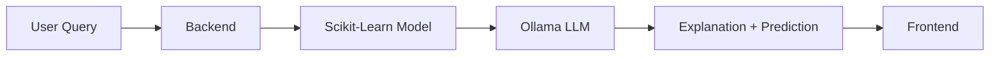

# Future Plans: Integrating Local LLM with NBA Prediction Model

## Overview
This document outlines the plan to enhance our existing NBA matchup predictor (scikit-learn) by adding a natural language interface using a local LLM (via Ollama). The goal is to:
1. **Explain predictions** in human-readable terms.
2. **Answer user questions** about stats, teams, and historical trends.
3. **Explore "what-if" scenarios** (e.g., injuries, lineup changes).

---

## Phase 1: Setup Ollama + Basic Integration
### Tasks:
- [ ] Install [Ollama](https://ollama.ai/) locally and test models (`mistral`, `llama3`).
- [ ] Create a Flask/FastAPI endpoint that:
  - Takes a user query (e.g., `"Who wins Lakers vs. Celtics?"`).
  - Calls the existing scikit-learn model for win probabilities.
  - Passes the raw prediction + stats to Ollama for explanation.
- [ ] Example prompt template:
  ```text
  The model predicts {team1} has a {win_prob}% chance to win against {team2}. 
  Key stats: {team1} offensive rating: {ortg}, {team2} rebound rate: {reb_rate}.
  Explain this prediction in 1-2 sentences for a basketball fan.

---

## Phase 2: Enhanced Features
### Natural Language Queries
- [ ] Support questions like:
  - *"Why is Team X favored?"*
  - *"What’s the most important stat in this matchup?"*
- [ ] Use LLM to **extract intent** from queries before calling the ML model.

### "What-If" Scenarios
- [ ] Allow users to simulate conditions:
  - *"How does the prediction change if Player Y is injured?"*
- [ ] Adjust input features to the scikit-learn model dynamically.

### Historical Comparisons
- [ ] Use LLM to find similar past games from the dataset:
  - *"Has Team X beaten Team Y when they were underdogs before?"*

---

## Phase 3: Frontend Chat UI
- [ ] Build a React/Next.js interface with:
  - A chat window for natural language queries.
  - Visualizations (e.g., win probability bars, key stat comparisons).
  - Toggle for "simple" vs. "technical" explanations.

---

## Technical Considerations
### Data Flow


### Dependencies
- Ollama (local)
- Flask/FastAPI (backend)
- NBA API or custom dataset (stats)
- React/Next.js (frontend)

---

## Challenges & Mitigation
| Challenge | Solution |
|-----------|----------|
| LLM latency | Cache common explanations |
| Offensive/defensive stat ambiguity | Fine-tune prompts with basketball terms |
| User vague queries | Add clarification follow-ups (e.g., "Do you mean regular season or playoffs?") |

---

## Timeline
1. **Week 1**: Ollama setup + basic integration.
2. **Week 2-3**: Implement "what-if" scenarios + frontend prototype.
3. **Week 4**: User testing + polish.

---

## Success Metrics
- Users can get accurate predictions **and** understand why.
- 80% of testers prefer the LLM-augmented version over raw probabilities.
```