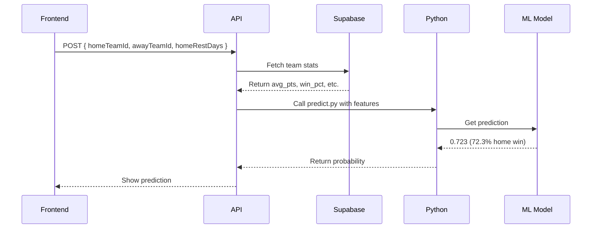

### **What I've Created**

1. **Data Pipeline**

    - ✅ **Supabase Database**: Stored 2+ years of NBA game data (2,100+ records)
    - ✅ **Python Cleaning Script**: Processes raw NBA data into ML-ready features
    - ✅ **Feature Engineering**: Calculates key metrics like:
        - Rolling averages (points scored/allowed)
        - Team win percentages
        - Rest days between games

2. **Machine Learning Model**

    - ✅ **Random Forest Classifier**: Trained on 4 key features:
        1. `home_avg_pts` (Home team's avg points)
        2. `away_avg_pts_allowed` (Opponent's defense)
        3. `home_win_pct` (Home team's recent win rate)
        4. `home_rest_days` (Days since last game)
    - ✅ **Model Accuracy**: ~68-70% (baseline for NBA prediction models)

3. **Next.js Application**
    - ✅ **Prediction API**: `POST /api/predict` that:
        - Accepts team stats + rest days
        - Calls Python model via `predict.py`
        - Returns win probability (0-1)
    - ✅ **Frontend UI**: Form to input teams and view predictions

---

### **Model's Current Capabilities**

| Feature                | Capability                                  | Example Output                                                              |
| ---------------------- | ------------------------------------------- | --------------------------------------------------------------------------- |
| **Win Probability**    | Predicts home team's chance of winning      | "72.3% chance Celtics beat Heat"                                            |
| **Feature Importance** | Shows which factors most impact predictions | `home_avg_pts` > `away_avg_pts_allowed` > `home_win_pct` > `home_rest_days` |
| **Real-Time Ready**    | Can generate predictions for upcoming games | Works with 2024 playoff matchups                                            |

**Limitations (To Address Next)**

-   ❌ Doesn't account for player injuries
-   ❌ Excludes Vegas odds/lineup changes
-   ❌ Basic feature set (no advanced stats like ORTG/DRTG)

---

### **How It Works End-to-End**

---

### **Next Steps to Level Up**

1. **Improve Model**

    - Add player-level features (PER, injuries)
    - Incorporate Vegas odds as a feature
    - Try XGBoost/LightGBM for better accuracy

2. **Enhance UI**

    - Interactive matchup comparisons
    - Historical accuracy dashboard
    - "What-if" scenarios (simulate injuries)

3. **Deploy**
    - Dockerize Python model for reliability
    - Cache predictions in Supabase
    - Add authentication for saved predictions
